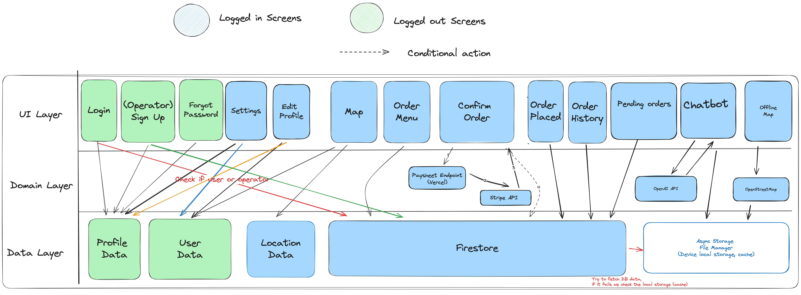

# Functional Requirements

## Key Features of the MVP

### Location-Based Ordering

- **Motivation**: Users often find themselves in remote areas with limited access to essential supplies. Ensuring that these supplies can be ordered conveniently and delivered accurately is crucial for enhancing the user experience and providing a sense of security.
  
- **Proposed Solution**: 
  - **Interactive Map Interface**: An intuitive map interface allows users to place orders based on their current location, enhancing convenience and accessibility.
  - **Real-Time Location Tracking**: Ensures precise delivery by tracking the user's location.
  - **Order Placement from the Map**: Users can place orders directly from the map, ensuring efficient order processing.

### Order Status Updates

- **Motivation**: Transparency and reassurance throughout the delivery process are essential for user satisfaction. Providing timely updates on order status helps reduce uncertainty and keeps users informed.
  
- **Proposed Solution**: 
  - **Real-Time Notifications**: Users receive push notifications at key points in the delivery process, such as order confirmation, drone deployment, and delivery completion.
  - **Status Tracking**: Users can check the status of their orders in the app at any time.
  - **Historical Order Tracking**: Allows users to view past orders and their statuses.
  - **Operator Notifications**: Operators are notified when users place orders, reducing the time needed to match an order to an operator.

### AI Chat Assistant

- **Motivation**: Outdoor enthusiasts frequently require quick access to reliable information. An AI chatbot can provide timely and accurate responses to queries, improving the overall user experience and satisfaction.
  
- **Proposed Solution**: 
  - **AI Chatbot Integration**: Allows for intuitive and interactive dialogue between users and the system.
  - **Query Processing and Response Generation**: The AI processes queries and generates appropriate responses, providing relevant information promptly.
  - **Contextual Understanding**: Ensures responses are relevant to the user's needs.
  - **Caching of Previous Conversations**: Allows users to revisit and reference past interactions, enhancing convenience and reliability.

### Operator Management Tools

- **Motivation**: Efficient order management is vital for timely and accurate deliveries. Operators need intuitive tools to streamline the process, ensuring that orders are handled effectively.
  
- **Proposed Solution**: 
  - **Operator Dashboard**: Provides a comprehensive overview of all operations, including pending, ongoing, and completed deliveries.
  - **Pending Orders Map Interface**: Visually displays all orders awaiting action, allowing operators to prioritize tasks based on geographic location.
  - **Order Acceptance/Rejection Functionality**: Enables operators to manage their workload and ensure timely delivery of services.
  - **Drone Interface**: Tools to monitor and control drone operations.

### Offline Functionality

- **Motivation**: In areas with poor connectivity, users still need access to essential features. Offline functionality ensures that users can navigate maps and access crucial information without an internet connection.
  
- **Proposed Solution**: 
  - **Offline Map Access**: Allows users to navigate and utilize the map without needing connectivity.
  - **Caching of Key Data**: Ensures that essential information, such as previously viewed locations or routes, is available offline.
  - **Offline Guides**: Provide valuable resources and information about various outdoor activities, locations, and safety tips.
  - **AI Chatbot Offline Access**: Users can access previous conversations with the chatbot even without connectivity, ensuring they have the necessary guidance and information readily available.

